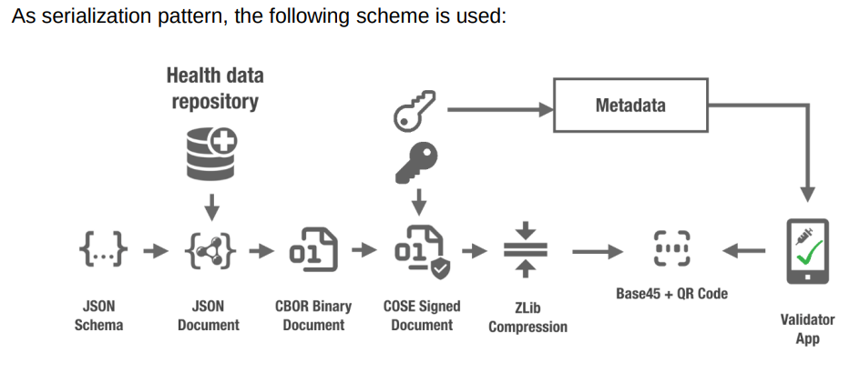

# eHealthDecoder
eHealth Digital Green Certificates


## Usage

```
./eHealthDecoder.py <QR CODE DATA>
```

## Example


## Serialization



## References

- [JSON Schema for EU Digital COVID Certificates](https://ec.europa.eu/health/sites/health/files/ehealth/docs/covid-certificate_json_specification_en.pdf)
- [2D Barcode Specifications](https://ec.europa.eu/health/sites/health/files/ehealth/docs/digital-green-certificates_v3_en.pdf)
- [EU Digital COVID Certificate](https://ec.europa.eu/health/ehealth/covid-19_en)

